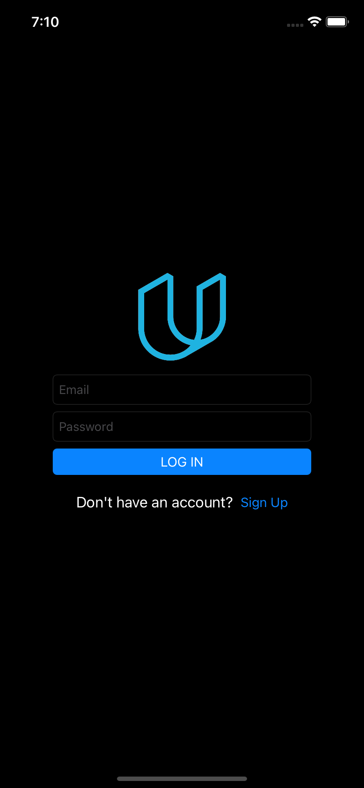

# OnTheMap App

Third project of the [iOS Developer Nanodegree course](https://www.udacity.com/course/ios-developer-nanodegree--nd003).

## Getting Started

Download the project from [Github](https://github.com/RicardoBravoA/OnTheMap), the updated branch is **main**

## Project Instructions

The project has this features.

    
    
    
    
    
    
    
    
    

- Login
    - Validate email and password not empty.
    - Show loading.
    - Show errors from backend.
- Main
    - Map View.
    - List View.
    - Show student location.
    - Add student location button.
    - Refresh students location.
    - Logout button
- Add Meme
    - Add Header and Footer.
    - Select Picture from Gallery or take a photo.
    - Share Meme
- Add Student Location
    - Location and website validation.
    - Get coordinates from location
- Finish Add Student Location
    - Show location in map
    - Save button and back to Main with data reloaded
- Logout
    - Navigate to login         

## License

    Copyright 2021 Ricardo Bravo (Woz).

    Licensed under the Apache License, Version 2.0 (the "License");
    you may not use this file except in compliance with the License.
    You may obtain a copy of the License at

       http://www.apache.org/licenses/LICENSE-2.0

    Unless required by applicable law or agreed to in writing, software
    distributed under the License is distributed on an "AS IS" BASIS,
    WITHOUT WARRANTIES OR CONDITIONS OF ANY KIND, either express or implied.
    See the License for the specific language governing permissions and
    limitations under the License.